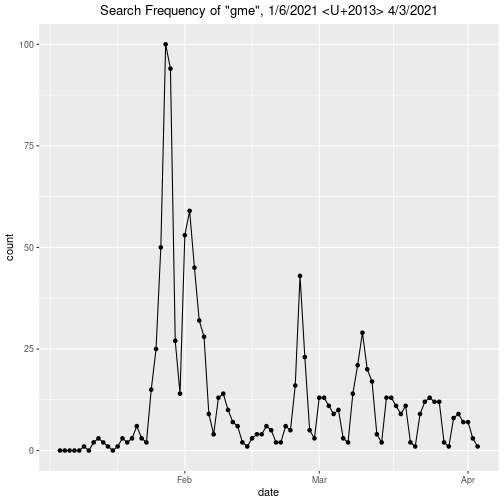
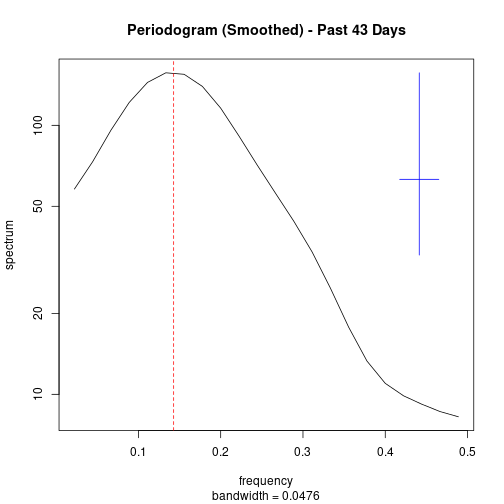
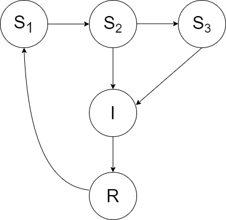
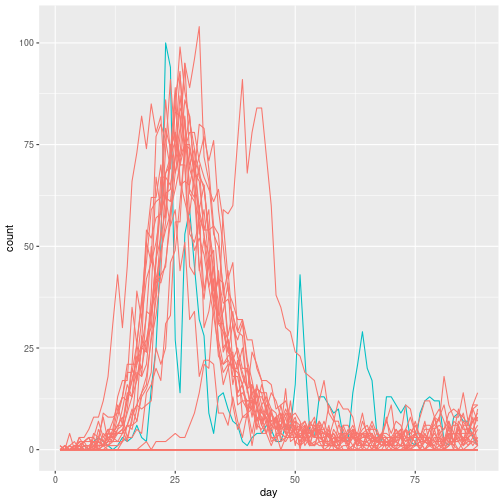
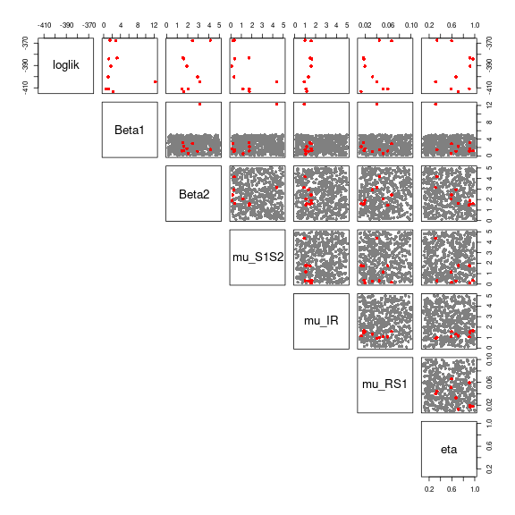
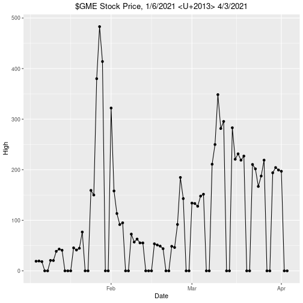
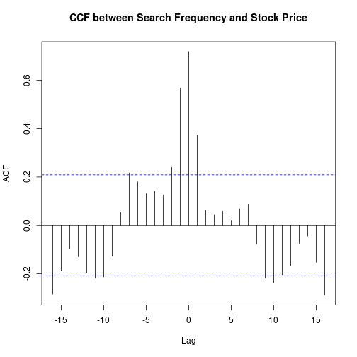

<div style='color:red'>
TODO:

- Section 4 (Parameter Search)
  * find optimal parameters
  * compute optimal likelihood
  * what else?

- Section 5 (Diagnostics)
  * scatterplot matrix
  * profile likelihoods
  * what else?

- Section 6 (Stock Price)
  * all of 6.2 - mathematical formulation of model
  * all of 6.3 - global search, again
  * all of 6.4 - likelihood ratio test

- Section 7 (Conclusions)

- Section 8 (Limitations)

</div>


# 1. Introduction

Social scientists have long drawn comparisons between the spread of information and the spread of disease. Methods from epidemiology have been used to model such dynamics by treating an idea, meme, or news event as the infectious agent; this analogy has only grown in popularity with the explosive growth of social media  [[1](https://www.sciencedirect.com/science/article/pii/S0307904X11002824), [2](https://engineering.stanford.edu/magazine/article/how-fake-news-spreads-real-virus)].

In this project, we apply epidemiological methods -- specifically, compartmental models -- to model information flow during the 2021 GameStop short squeeze, an event in which thousands of Reddit users coordinated to buy shares of the gaming company GameStop, having anticipated a short by major hedge funds. The resulting jump in stock price caused such hedge funds to incur significant losses, resulting in a flurry of attention on both social media sites and major news networks [[3](https://en.wikipedia.org/wiki/GameStop_short_squeeze)].

We use search frequency of the term "gme", GameStop's ticker symbol, as a proxy for the spread of news. The data was downloaded from Google Trends [[4](https://trends.google.com/trends/)], consisting of normalized daily measurements over an 88-day period. We also include GameStop's stock price (\$GME) for the same time period, downloaded from Yahoo Finance [[5](https://finance.yahoo.com/)].

The main objectives of this project are as follows: 

1. Model the information spread of a current event using an interpretable model.

2. Draw parallels between the spread of information and the spread of disease.

Additionally, it may be interesting to investigate if the stock price can be viewed as an external driver for the GME hype. Thus, we seek to:

3. Determine the relationship between GameStop's stock price and search frequency.

------------

# 2. Exploratory Data Analysis



  
First, we note that the search data are normalized to have a maximum value of $100$. Understandably, the search frequency of the term "gme" peaks in late January, during the initial short squeeze. Notably, the data strongly resemble the measles dataset studied in class, lending support to the idea that such trends can be modeled using methods from epidemiology.

The initial peak is followed by multiple, smaller peaks in the following months. This latter half of the data seems to exhibit strong weekly seasonality, as shown in the plot of the smoothed periodogram below. However, this may be because many stock exchanges are closed on weekends, and not something directly attributable to the short squeeze itself  [[6](https://www.investopedia.com/terms/w/weekendeffect.asp)]. 

(Later on, we will directly investigate how the stock price is related to the search frequency in the <span style='color:red'>[SECTION NAME]</span> section.)



```
[1] "period corresponding to maximum spectral density (days): 7.5"
```

Combined with the evidence from the periodogram, the erratic, quasi-regular trend in the latter half of the data suggests that we may want to choose a model that accounts for both regular and irregular resurgences (or even delays) in popularity.

------------

# 3. Model Design

## 3.1. Model Structure

Given our analyses above, we find it appropriate to model our data with a compartmental model, commonly used in epidemiological studies -- specifically, we use a **SIRS model with delay**.

We define *susceptible* in this context to mean individuals who have not yet heard about the short squeeze, *infected* to mean individuals who have heard about the short squeeze and are actively interested in it, and *recovered* to refer to individuals who have lost interest in the short squeeze and have no further inclination to search about it. In analogy with the original SIR model, the *reporting rate* would be the proportion of interested individuals who end up actually searching about the event online.

We include two latent susceptible states $S_1$ and $S_2$. Intuitively, these two states are meant to differentiate between individuals who obtain their news from social media and individuals who may follow more traditional news sources. Since information spreads faster through social media than through sources such as news networks and newspapers [[7](https://larswillnat.files.wordpress.com/2014/05/2013-american-journalist-key-findings.pdf), [8](https://www.journalism.org/2015/07/14/the-evolving-role-of-news-on-twitter-and-facebook/)], we have included a potential delay to represent individuals who are "late" in hearing about the short squeeze. Individuals progress from $S_1$ to either $S_2$ or the infected state $I$, and from $S_2$ to $I$ only.

Finally, consider that the popularity of a trend can *resurge* long after the initial event; indeed, this behavior seems to be evident in the data. Because of this, we suppose that recovered individuals (represented by the state $R$) move back into the initial susceptible state $S_1$ after some time. Our model is summarized in the diagram below.

<div style='margin:40px'>
<center>

</center>
</div>


## 3.2. Mathematical Formulation

The number of individuals in each compartment, at each time point $t$ are given by the following equations:

\begin{align*}
S_1(t) &= S_1(0) + N_{RS_1}(t) - N_{S_1S_2}(t) - N_{S_1I}(t) \\
S_2(t) &= S_2(0) + N_{S_1S_2}(t) - N_{S_2I}(t) \\
I(t) &= I(0) + N_{S_1I}(t) + N_{S_2I}(t) - N_{IR}(t) \\
R(t) &= R(0) + N_{IR}(t) - N_{RS_1}(t) \\
\end{align*}

where $N_{XY}$ is a counting process that represents the number of individuals transitioning from state $X$ to state $Y$. The associated compartment transfer rates are given by:

\begin{align*}
\frac{dN_{S_1S_2}(t)}{dt} &= \mu_{S_1S_2}S_1(t) \\
\frac{dN_{S_1I}(t)}{dt} &= \mu_{S_1I}(t)S_1(t) = \beta_1I(t)S_1(t) \\
\frac{dN_{S_2I}(t)}{dt} &= \mu_{S_2I}(t)S_2(t) = \beta_2I(t)S_2(t)\\
\frac{dN_{IR}(t)}{dt} &= \mu_{IR}I(t) \\
\frac{dN_{RS_1}(t)}{dt} &= \mu_{RS_1}R(t) \\
\end{align*}

We use Euler's method to compute approximations to the above rates. In particular, each transfer rate is discretely approximated by a binomial distribution with exponential transition probabilities:

\begin{align*}
\Delta N_{S_1S_2}(t) &\sim \mathrm{Bin}(S_1, 1 - e^{-\mu_{S_1S_2}\Delta t}) \\
\Delta N_{S_1I}(t) &\sim \mathrm{Bin}(S_1, 1 - e^{-\beta_1\frac{I}{N}\Delta t}) \\
\Delta N_{S_2I}(t) &\sim \mathrm{Bin}(S_2, 1 - e^{-\beta_2\frac{I}{N}\Delta t}) \\
\Delta N_{IR}(t) &\sim \mathrm{Bin}(I, 1 - e^{-\mu_{IR}\Delta t}) \\
\Delta N_{RS_1}(t) &\sim \mathrm{Bin}(R, 1 - e^{-\mu_{RS_1}\Delta t}) \\
\end{align*}

------------

## 3.3. Simulations


We simulate 50 trajectories from some manually chosen parameters in order to check the validity of our model. Noticeably, many of the trajectories seem to peak early, then level off around some smaller, nonzero value, much like the real data. Thus, we conclude that our model is reasonable, and continue on to conduct a parameter search.



-----------

# 4. Model Selection

The model parameters we are interested in estimating are:

- $\beta_1$ — the information transmission rate through social media
- $\beta_2$ — the information transmission rate through "traditional" news sources
- $\mu_{S_1S_2}$ — representing a latent delay in the susceptible population
- $\mu_{IR}$ — the recovery rate ("hype factor")
- $\mu_{RS_1}$ — the resurgence rate
- $\eta$ — the initial susceptible fraction 

Since the search frequency data are normalized to have maximum $100$, it will be difficult to interpret the reporting rate $\rho$ and population size $N$. We will still let these parameters vary so as to not overconstrain the model, but will ignore their interpretation in this project.

### Global Search.

We define an optimal set of parameters as one that maximizes the likelihood of the model. To do this, we use iterated filtering -- the IF2 algorithm -- to simulate and evaluate the likelihood of many randomly-chosen candidate parameter sets. As a benchmark, we compute the likelihood of the parameter set used in the simulation in the previous section:


```
[1] "log-likelihood: -647.815097007068"
```

```
[1] "standard error: 2.27784114446601"
```
<!-- ACTUAL GLOBAL SEARCH -->





Finally, we obtain our best parameter set:


```
       Beta1      Beta2    mu_S1S2      mu_IR     mu_RS1        eta
A 1.50861689 4.15964925 0.32028841 0.99380966 0.04474776 0.33828206
```

```
       loglik   loglik.se
A -367.431335    1.391802
```

-----------

# 5. Model Diagnostics

- do profile likelihood, etc.

-----------

# 6. The Effect of Stock Price

In the [Introduction]() and [Exploratory Data Analysis]() sections, we raised the question of how the value of $GME may affect or at least be associated with its search frequency. In this section, we'll include the stock price as a covariate and determine if the resulting model is a better fit.

## 6.1 Exploratory Data Analysis



Plotting the stock price data, we see that the first half of the data strongly resembles the trend seen in the search frequency, but starts to diverge more in the latter half. Noticeably, the seasonality apparent in the search data is not nearly as present here.

We can plot the sample cross-correlation (CCF) between the stock price and the search frequency to more formally explore the relationship between the two.



We see that the search frequency of the term "gme" is most significantly correlated with the value of $GME about a week prior. There is also evidence that the search frequency *precedes* the stock price, indicating that there may be some sort of nonlinear, cyclical relationship between the two. However, we will stick with the hypothesis that the stock price is the one influencing the search frequency, and not vice versa.

## 6.2. Model Design

- include price as a covariate in this model

## 6.3. Model Selection 

note: the following code does not contain an accumulator variable $H$.


- global parameter search

<!-- Model Diagnostics ??? -->

## 6.4. Model Comparison

- compare likelihood of this one to likelihood of above model (use Wilks' approximation)

------------

# 7. Conclusion

* compare $\beta_1$ to $\beta_2$ - make conclusion about speed of info transmission between news sources
* interpret $\mu_{IR}$, rate of recovery (hype factor) - how fast do trends fade?
* interpret $\eta$, initial susceptible fraction - what is the reach of one influential person?
* interpret $\mu_{RS_1}$, the resurgence rate - how often / likely to trends reoccur?

* is there evidence that incorporating stock price results in a better fit? aka, is there evidence that stock price is an external forcing variable for search frequency?

* how well was the data modeled by the SIRS model? What can we say about the relationship between information and disease?

------------

# 8. Limitations 

- make resurgence rate constant $\mu_{RS_1}$ time-varying
- make reporting rate $\rho$ time-varying
- reverse causation - although somewhat beyond the scope of this project, the greater question is: can social trends have an impact of stock prices, or do the stock prices determine such trends in the first place (...or both)? 

- computing: likelihoods were often infinite and diverged, suggesting that the model is misspecified

------------

# 9. References  

[1] [Wang, Lin & Wood, Brendan](https://www.sciencedirect.com/science/article/pii/S0307904X11002824), "An Epidemiological Approach to Model the Viral Propagation of Memes". <br> &nbsp;&nbsp;&nbsp;&nbsp;&nbsp;&nbsp; *Applied Mathematical Modelling*, Volume 35, Issue 11: 5442-5447. November 11, 2011.

[2] [Stanford University](https://engineering.stanford.edu/magazine/article/how-fake-news-spreads-real-virus), "How Fake News Spreads Like a Real Virus". October 9, 2019.

[3] [Wikipedia](https://en.wikipedia.org/wiki/GameStop_short_squeeze), "GameStop Short Squeeze". Accessed April 8, 2021.

[4] [Google Trends](https://trends.google.com/trends/), Google. Accessed April 6, 2021.

[5] [Yahoo Finance](https://finance.yahoo.com/), Yahoo. Accessed April 9, 2021.

[6] [Investopedia](https://www.investopedia.com/terms/w/weekendeffect.asp), "Weekend Effect". Accessed April 13, 2021.

[7] [Indiana University](https://larswillnat.files.wordpress.com/2014/05/2013-american-journalist-key-findings.pdf), “The American Journalist in the Digital Age: Key Findings”. 2014.

[8] [Pew Research Center](https://www.journalism.org/2015/07/14/the-evolving-role-of-news-on-twitter-and-facebook/), “The Evolving Role of News on Twitter and Facebook”. July 14, 2015.

[9] [Statista](https://www.statista.com/topics/1001/google/), "Google -- Statistics & Facts". February 25, 2021.

<div style='margin-top: 25px'>
Our project took inspiration from the following former STATS 531 projects: [W20 Project 32](https://ionides.github.io/531w20/final_project/Project32/final.html) for the SIR model with delay, and <br> [W18 Project 13](https://ionides.github.io/531w18/final_project/13/final.html) and [W20 Project 34](https://ionides.github.io/531w20/final_project/Project34/final.html) for the idea of applying epidemiological models to information spread. All uncited statistical <br> methods, as well as the code used in this project, were adapted from the [STATS 531](https://ionides.github.io/531w21/) class notes.
</div>
----

We collaborated on all sections of the project with approximately equal contribution. Eric took the lead on the Introduction, Model Design, Conclusion, and Limitations, while Bella took the lead on Model Selection and Model Diagnostics. We usually worked independently on the above sections, but then met up both during class and outside of class to discuss our reasoning and share ideas / feedback. We would also hold pair programming sessions over Zoom in order to debug code. 
